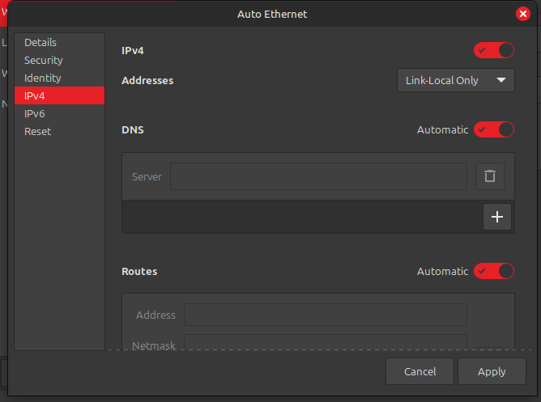
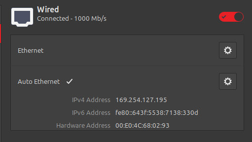
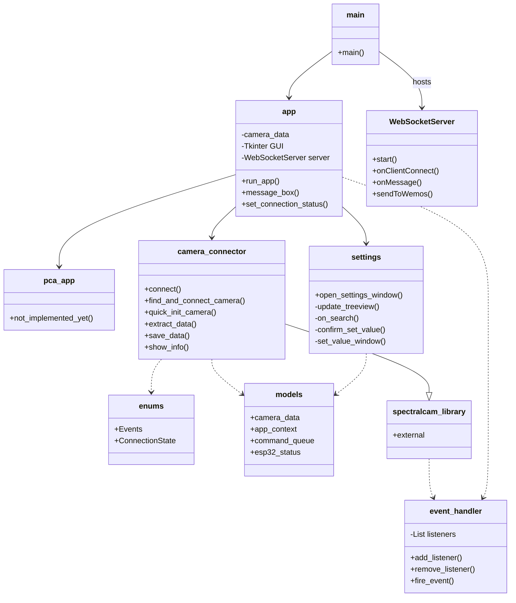

# Hyperspectral-imaging
FX10 Camera made by Specim

Opstelling's code is from: https://github.com/Momin2004/Hyperspectral-imaging-lab

# Using the project
Install Anaconda using: https://www.anaconda.com/download/success </br>
Open Anaconda Prompt </br>
Type ```conda -V``` to check if Anaconda is succesfully installed </br>
Type ```conda create -n env python=3.10.16 anaconda``` </br>
Type ```conda activate env``` </br>
Type ```git clone https://github.com/Stefsk-glitch/Hyperspectral-imaging``` </br>
Type ```pip install -r requirements.txt``` </br>


# Running the app on Linux
## Install Python 3.10.16
- ```wget https://www.python.org/ftp/python/3.10.16/Python-3.10.16.tgz```
- ```tar xzf Python-3.10.16.tgz```
- ```cd Python-3.10.16```
- ```sudo apt install tk-dev tcl-dev```
- ```./configure --enable-optimizations```
- ```sudo make altinstall```

## Create an environment inside of the project root floder
- ```python3.10 -m venv venv```
- ```source venv/bin/activate```
- ```pip install -r requirements.txt```

## Run the app
- Inside of venv environment, run: ```python main.py```<br>

The app may not find any camera's. Set network settings to local link only for ethernet.
- Make sure port 3956 is allowed through firewall
    - Check if UFW is installed: ```sudo ufw status```
    - If it is not installed: ```sudo apt install ufw```
    - Enable UFW: ```sudo ufw enable```
    - Allow port 3956: ```sudo ufw allow 3956```
- Internet settings should look something like this:



# Diagram


## installing detectron 2
git clone https://github.com/facebookresearch/detectron2.git </br>
python -m pip install -e detectron2
