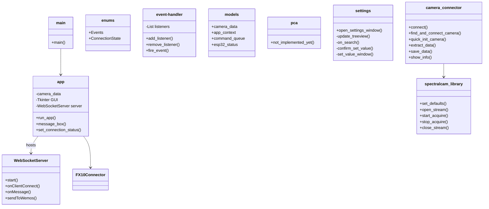

```mermaid
classDiagram

class main {
    +main()
}

class enums {
    +Events
    +ConnectionState
}

class event-handler {
    +add_listener()
    +remove_listener()
    +fire_event()

    -List listeners
}

class models {
    +camera_data
    +app_context
    +command_queue
    +esp32_status
}

class pca {
    +not_implemented_yet()
}

class settings {
    +open_settings_window()
    -update_treeview()
    -on_search()
    -confirm_set_value()
    -set_value_window()
}

class app {
    +run_app()
    +message_box()
    +set_connection_status()
    -camera_data
    -Tkinter GUI
    -WebSocketServer server
}

class WebSocketServer {
    +start()
    +onClientConnect()
    +onMessage()
    +sendToWemos()
}

class camera_connector {
    +connect()
    +find_and_connect_camera()
    +quick_init_camera()
    +extract_data()
    +save_data()
    +show_info()
}

class spectralcam_library {
    +set_defaults()
    +open_stream()
    +start_acquire()
    +stop_acquire()
    +close_stream()
}

main --> app
app --> WebSocketServer : hosts
app --> FX10Connector
camera_connector --> spectralcam_library
```